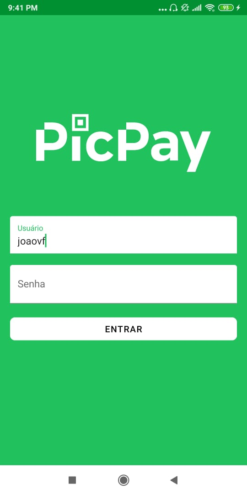
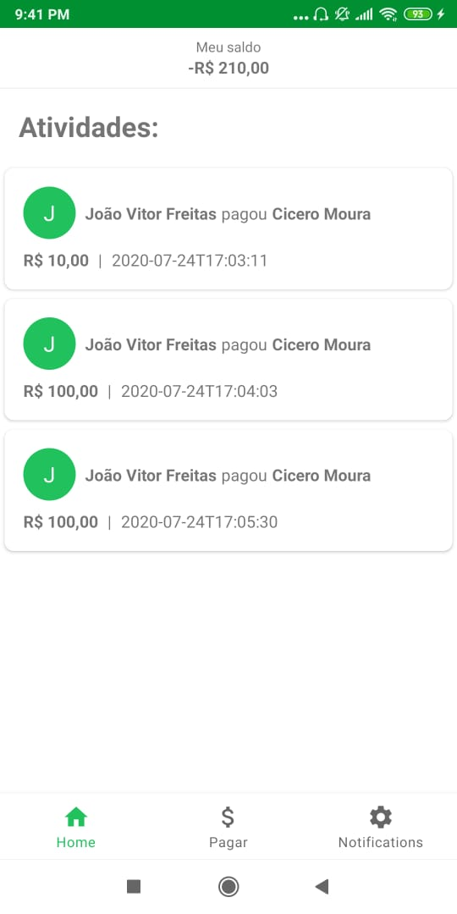
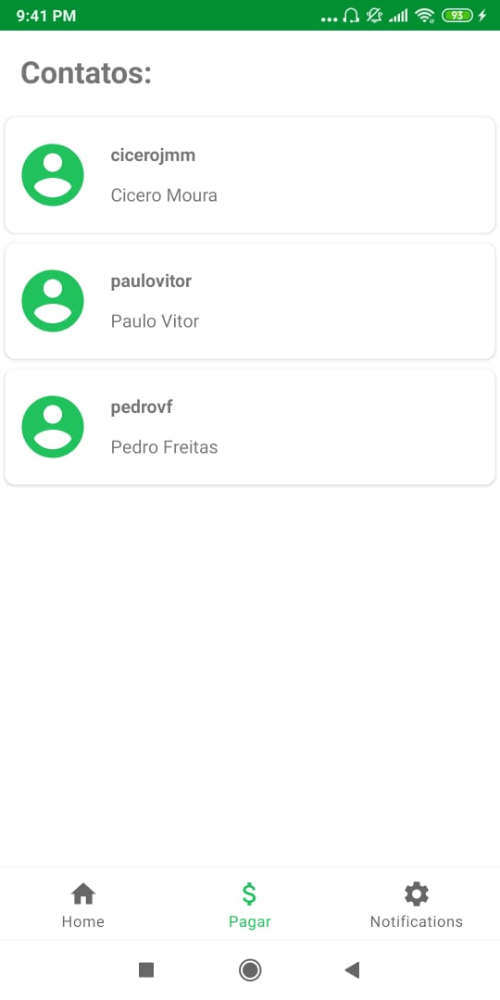
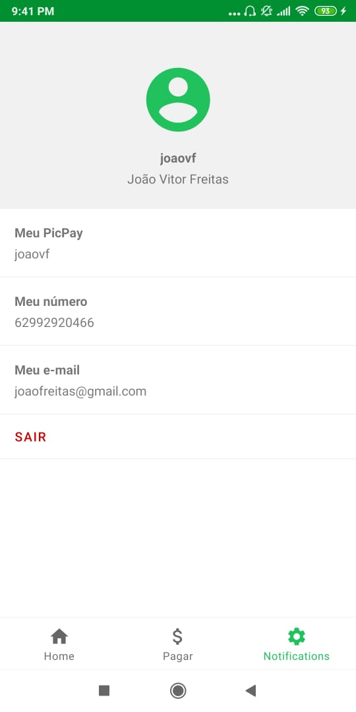

    <h1> PicPay Clone </h1>

 

| | | | |
|:-------------------------:|:-------------------------:|:-------------------------:|:-------------------------:|
| | || |
 

 <a href="#target">Target</a> •
 <a href="#technologies">Technologies</a> •
 <a href="#route">Route</a>

 
 

<h2> 💡 Target </h2>
Clone of PicPay application, using a robust and testable architecture, from app to servidor side. 
For the Android, using the MVVM structural pattern. 
For the servidor side, building an API RESTful with Spring Boot structure to simulate PicPay features.

 

<h2> 🛠 Technologies </h2>
The following tools were used in building the project:  

|                  Type                  |                Tools                |                                 References                                  |
| :------------------------------------: | :---------------------------------: | :-------------------------------------------------------------------------: |
|       Programming Language (App)       |              KOTLIN                 |              https://kotlinlang.org/                                        | 
|                   IDE                  |          ANDROID STUDIO             |              https://developer.android.com/studio                           |
|          Injection Framework           |                KOIN                 |              https://insert-koin.io/                                        |
|                 Testing                |                JUNIT5               |              https://junit.org/junit5/                              |
|            HTTP API Library            |              RETROFIT2              |              https://square.github.io/retrofit/                             |
|          HTTP Client Library           |              OkHTTP3                |              https://square.github.io/okhttp/                               |
|           API RESTful (JSON)           |               SWAGGER2              |              https://swagger.io/                                            |
|   Programming Language (Server Side)   |                JAVA                 |              https://docs.oracle.com/javase/tutorial/                       |
|               Spring Boot              |            SPRING BOOT              |              https://start.spring.io/                                       |
|                 Database               |            POSTGRE SQL              |              https://www.postgresql.org/                                    |
|          In-memory data store          |                 REDIS               |              https://redis.io/                                    |
|                 Security               |                 JWT                 |              https://jwt.io/                                          |

 
 

  <h3>Frontend</h3>
  
  
  
  
  
  
   
  <h3>Backend | API</h3>
  
  
  
   
  
   
  
   
  

<h2> 🔎 Route </h2>

<ol>
    <li>Step 1 - Setting up the environment</li>
     
    <li>Step 2 - Building our API RESTful</li>
    API Architecture
    
     
    Classes Diagram for Database
    
     
    The API is based on RESTful model and contains:
    <ul>
      <li> Spring Boot </li>
      <li> Spring Security and JWT </li>
      <li> Spring Data with PostgreSQL </li>
      <li> Cache with Redis </li>
      <li> Documentation with Swagger 2 </li>
      <li> Managing with Spring Actuator </li>
    </ul>
    <li>Step 3 - Building our Android app</li>
    The app follows MVVM pattern e shows the technologies of:
    <ul>
      <li>Retrofit2</li>
      <li>ViewModel</li>
      <li>LiveData</li>
      <li>Coroutines</li>
      <li>Koin</li>
      <li>Navigation</li>
      <li>Room</li>
    </ul>
     
    <li>Step 4 - Creating our interface</li>
     
    <li>Step 5 - Consuming a RestFULL API</li>
</ol>

 
 